# 🏥 Healthcare Readmission Prediction & End-to-End Data Analytics


> An end-to-end Healthcare Data Analytics & Machine Learning project covering **EDA, Funnel Analysis, Statistical Analysis, Predictive Modeling, Risk Stratification, and Dashboard Development**.

---

# 📊 Executive Analytics Dashboard

The dashboard consolidates the complete analysis into a single executive view including patient demographics, readmission trends, model performance, feature importance, confusion matrix, ROC curve, and risk stratification.

<p align="center">
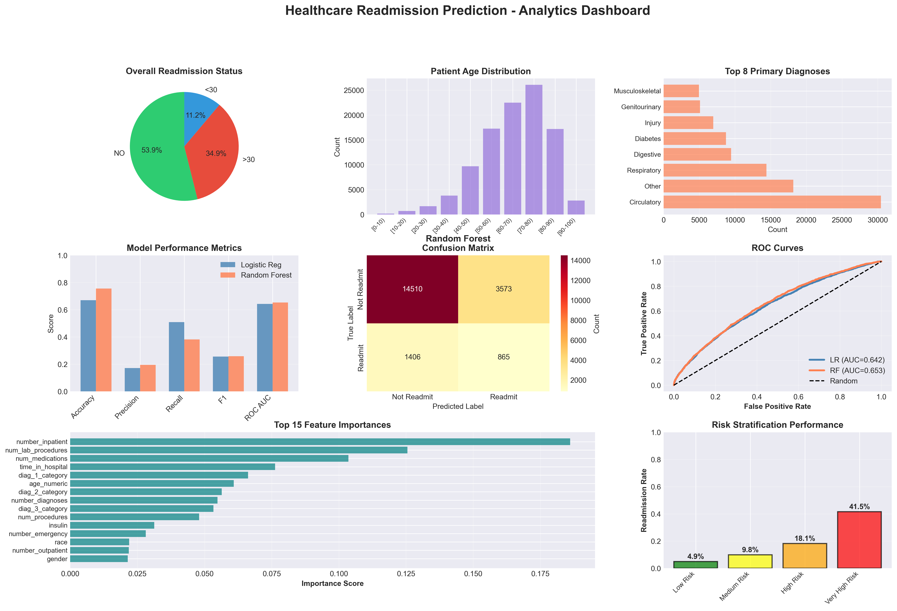
</p>

---

# 📌 Project Overview

Hospital readmissions significantly increase healthcare costs and reduce operational efficiency. This project analyzes historical patient records to uncover the major drivers behind hospital readmissions and builds machine learning models capable of predicting patients at high risk.

The project demonstrates a complete analytics workflow:

- Data Cleaning & Preprocessing
- Exploratory Data Analysis (EDA)
- Funnel Analysis
- Statistical Analysis
- Feature Engineering
- Machine Learning
- Model Evaluation
- Risk Stratification
- Executive Dashboard

---

# 🎯 Business Objectives

- Predict patient readmission risk
- Identify key clinical and demographic drivers
- Reduce unnecessary readmissions
- Assist hospitals in patient prioritization
- Support data-driven healthcare decisions

---

# 🔄 End-to-End Analytics Pipeline

```text
Raw Healthcare Dataset
        │
        ▼
Data Cleaning & Preprocessing
        │
        ▼
Exploratory Data Analysis
        │
        ▼
Feature Engineering
        │
        ▼
Funnel Analysis
        │
        ▼
Statistical Analysis
        │
        ▼
Machine Learning
(Logistic Regression & Random Forest)
        │
        ▼
Model Evaluation
        │
        ▼
Risk Stratification
        │
        ▼
Executive Dashboard
```

# 📈 Exploratory Data Analysis (EDA)

Performed comprehensive EDA including:

- Missing Value Analysis
- Univariate Analysis
- Bivariate Analysis
- Multivariate Analysis
- Distribution Analysis
- Outlier Detection
- Correlation Analysis
- Business Insight Generation

## Numeric Feature Distributions

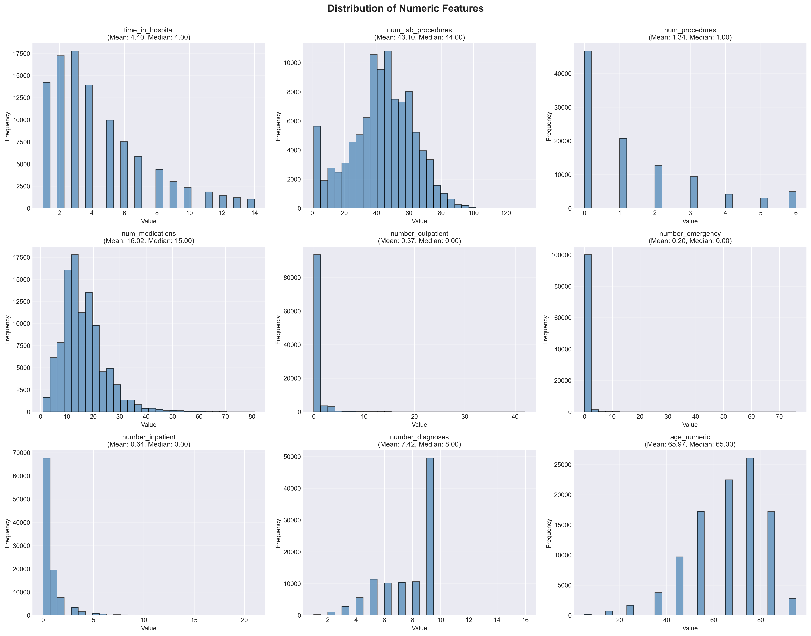

Key observations:
- Hospital stay concentrated around 3–5 days
- Medication counts are right-skewed
- Previous inpatient/outpatient visits are highly skewed
- Elderly patients dominate the dataset

## Categorical Feature Analysis

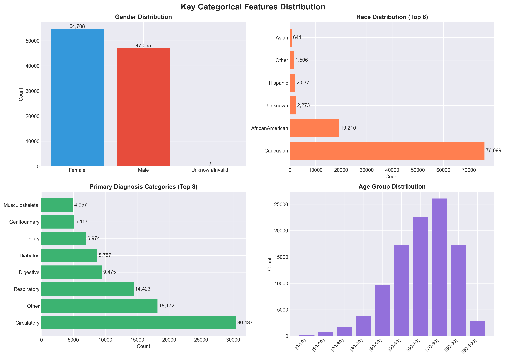

Analyzed:
- Gender
- Race
- Age Groups
- Primary Diagnosis Categories

## Numeric Features vs Readmission

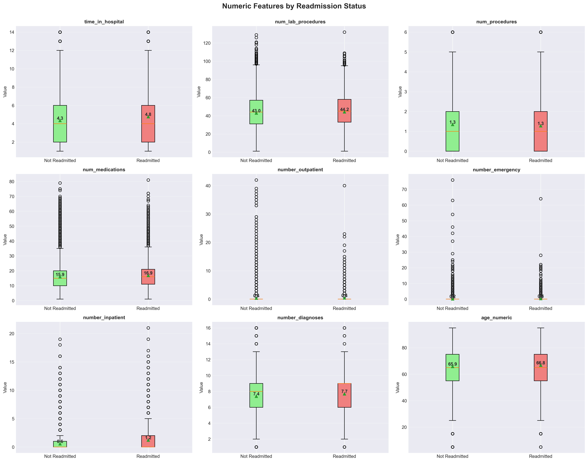

Insights:
- Readmitted patients generally stay longer.
- Higher medication counts correspond to higher readmission risk.
- Previous inpatient visits strongly influence future readmissions.

## Categorical Readmission Analysis

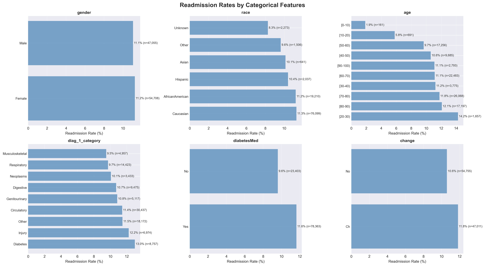

Compared readmission rates across:
- Gender
- Race
- Age
- Diagnosis Category
- Diabetes Medication
- Medication Change

## Correlation Matrix

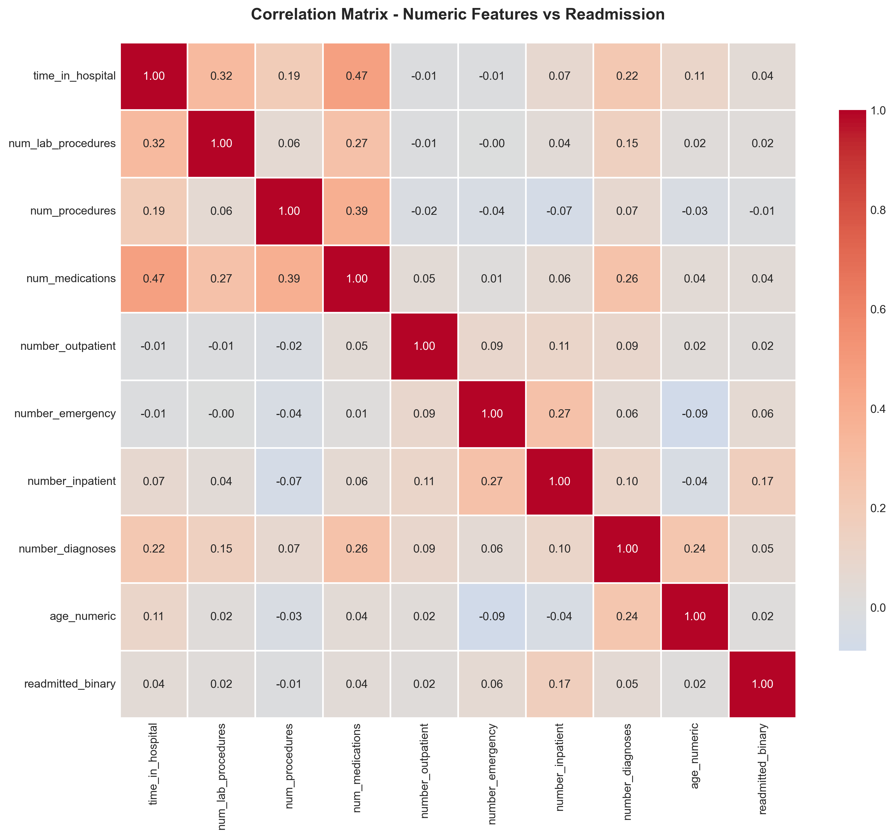

Correlation analysis was used to identify relationships among numerical variables and remove redundant information before modeling.

---

# 🔍 Funnel Analysis

A healthcare funnel was created to study the patient journey.

```text
Admission
   ↓
Hospital Stay
   ↓
Lab Procedures
   ↓
Medications
   ↓
Diagnosis
   ↓
Discharge
   ↓
Readmission
```

### Funnel Insights

- Longer hospitalization increased readmission probability.
- More medications were associated with higher risk.
- Previous inpatient admissions emerged as the strongest indicator.
- Diagnosis complexity contributed to future readmissions.

---

# 🤖 Machine Learning

Models Developed

- Logistic Regression
- Random Forest Classifier

Evaluation Metrics

- Accuracy
- Precision
- Recall
- F1 Score
- ROC-AUC

## Model Comparison

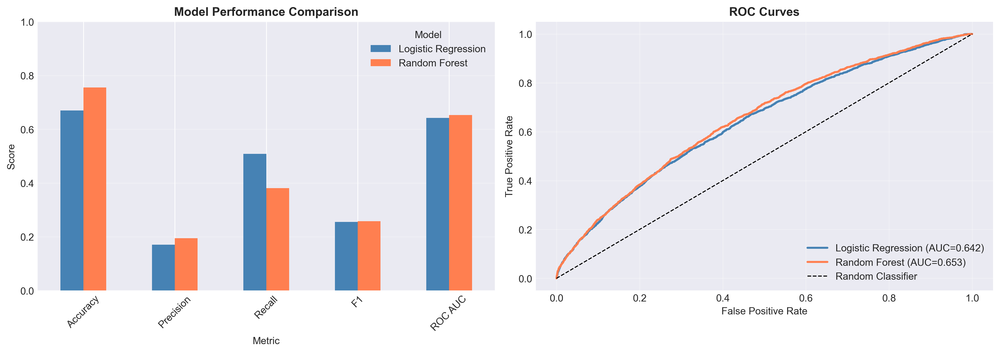

## Confusion Matrices

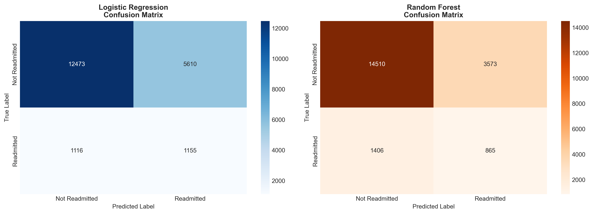

## Feature Importance

The Random Forest model identified the most influential predictors.

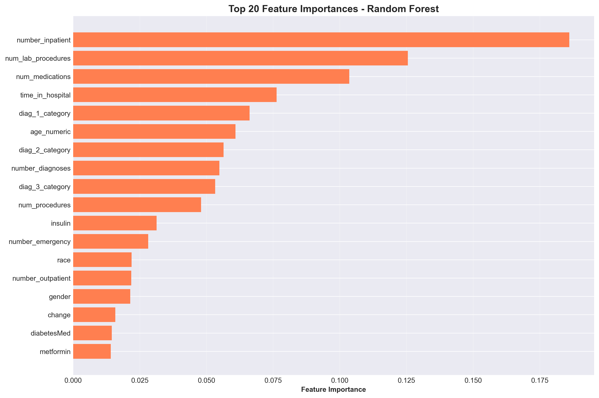

Top features:

1. Previous Inpatient Visits
2. Number of Lab Procedures
3. Number of Medications
4. Hospital Stay Duration
5. Primary Diagnosis
6. Age
7. Number of Diagnoses

## Prediction Probability Distribution

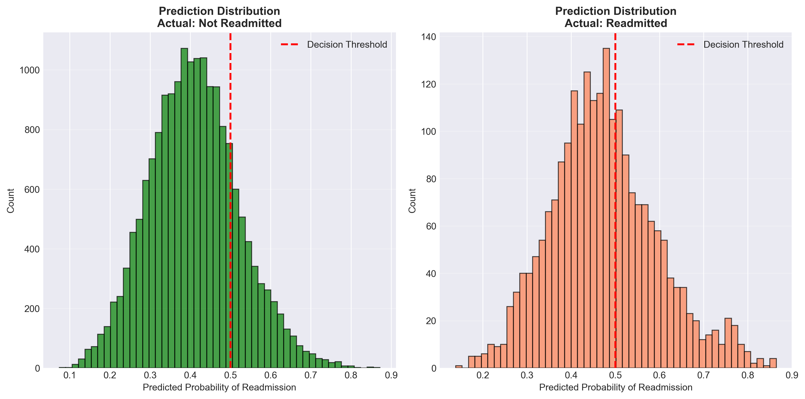

The probability distributions show clear separation between low-risk and high-risk patients while illustrating model confidence.

---

# 🚨 Risk Stratification

Patients were categorized into:

- 🟢 Low Risk
- 🟡 Medium Risk
- 🟠 High Risk
- 🔴 Very High Risk

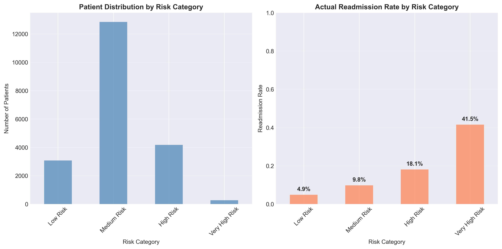

This helps healthcare providers prioritize monitoring and interventions.

---

# 📊 Dashboard Highlights

The executive dashboard summarizes:

- Overall Readmission Status
- Age Distribution
- Primary Diagnoses
- Model Performance
- ROC Curve
- Confusion Matrix
- Feature Importance
- Risk Categories

---

# 🛠️ Tech Stack

- Python
- Pandas
- NumPy
- Matplotlib
- Seaborn
- Scikit-learn
- Jupyter Notebook

---

# 📂 Project Structure

```text
Healthcare-Readmission-Prediction/
│
├── healthcare_analytics.ipynb
├── README.md
├── visualizations/
│   ├── 02_numeric_distributions.png
│   ├── 03_categorical_distributions.png
│   ├── 04_numeric_vs_readmission.png
│   ├── 05_categorical_vs_readmission.png
│   ├── 06_correlation_matrix.png
│   ├── 07_model_comparison.png
│   ├── 08_confusion_matrices.png
│   ├── 09_feature_importance.png
│   ├── 10_probability_distribution.png
│   ├── 11_risk_stratification.png
│   └── 12_FINAL_DASHBOARD.png
```

---

# 📌 Key Outcomes

- ✅ End-to-End Data Analytics Project
- ✅ Comprehensive EDA
- ✅ Funnel Analysis
- ✅ Statistical Analysis
- ✅ Machine Learning Models
- ✅ Risk Stratification
- ✅ Executive Dashboard
- ✅ Business Insights

---

# 💡 Business Impact

This project demonstrates how analytics and machine learning can help healthcare organizations:

- Identify high-risk patients before discharge.
- Reduce avoidable readmissions.
- Optimize clinical resource allocation.
- Improve patient outcomes with data-driven decision making.
